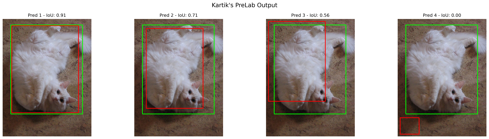
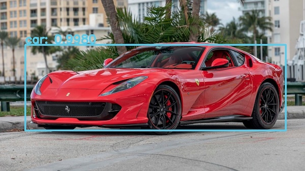

# EEC174 AY Project A1: Object Detection and Tracking
# Instructions (Do not clone this repo!)

Due Date: November 10, 2023

The focus of this lab is to learn how to apply YOLO on images & videos. In Phase 1 you will learn to load the YOLOv3 model into OpenCV, create blobs for OpenCV, detect objects, draw bounding boxes, and add labels onto images. In Phase 2 you will use open-source MOT solutions with YOLO to perform object tracking on video inputs. Please read all the instructions carefully.

## Environment Setup

You are not required to use the server or docker for this lab. Choose whatever environment you are comfortable with. Please install all dependancies that are in `requirements.txt` (with either conda or pip). You can also work on the server directly if you want to (without docker container). 

All required files are provided except the pretrained weights (as they were too large to upload on github). You will need to download the weights file (for phase 1 & 2) in the `yolo_files` folder by using the following command:

```
wget https://pjreddie.com/media/files/yolov3.weights
```
Or, you will find the weights at this location on the server (you can copy `yolov3.weights` but please do not move/remove them): ```/data/eec174/yolo_files/yolov3.weights```

(Note: When submitting do not upload the weights!)

## Pre-Lab: Bounding Boxes & IoU

Please make sure to complete and commit [PreLab.ipynb](PreLab.ipynb) before lab starts. Do not make any commits after.
You are provided with inital code to read and show [imgs/cat.jpg](imgs/cat.jpg). You are also given the ground truth bounding box labels (`gt_box`) in `x, y, w, h` format. Please do not change the image. 

***Note:*** Some of you may have a typo in `PreLab.ipynb` Part 1. Please make sure `image_path` is `imgs/cat.jpg` (do not use `cats.jpg`). If your PreLab.ipynb is already using `cat.jpg`, please ignore this!

The prelab requires you to:

1. Use provided ground truth bounding box (`gt_box`) to add a green colored box on the image. Hint: use `cv2.rectangle()`
2. Complete the `compute_iou()` function that computes intersection over union (IoU) given two input boxes. Hint: see lecture slides for Object Detection.
3. You are given a `predictions` array with 4 predicted boxes. plot each of them individually on the image in red, along with the ground truth on each image. As the title of the image, please include the prediction number (1 - 4) and the IoU score.

Instructions are also provided in the notebook. Please see the expected output for pre-lab below:



Please make sure to push `PreLab.ipynb` before lab starts on Nov 3.

## YOLO Tutorial

The [YOLO_OpenCV_Tutorial.ipynb](src/YOLO_OpenCV_Tutorial.ipynb) contains the full inference pipeline and code to draw bounding boxes onto a given image using OpenCV & YOLOv3. 
The given code provides a way to feed an image and draw (on the same image) bounding boxes and confidence score. The tutorial is adapted from the [OpenCV tutorial](https://opencv-tutorial.readthedocs.io/en/latest/yolo/yolo.html). You will have to modify the code provided to complete Phase 1 & 2.

If the following line throws an error:
```python
yolo_layers = [layers[i[0] - 1] for i in network.getUnconnectedOutLayers()]
```

Please replace it with:
```python
yolo_layers = ['yolo_82', 'yolo_94', 'yolo_106']
```

## Phase 1: YOLO Object Detection on Images 

Your task is to complete the [yolo_img_detector.py](src/yolo_img_detector.py) to perform object detection (with YOLOv3). This script must be able to take in path to image/images/folder of images and perform YOLO to report the following main tasks:

- The average inference time (across all input images specified)
- The total number of classes detected
- A breakdown for each class by class name and corresponding number of those classes found
- Store all specified images with bounding boxes, class names, and confidence scores drawn in `out_imgs`
- The output drawn/annotated images must be named with a '_out' attached in following style: `img_out.jpg` (for given `input img.jpg`)

You must adapt code from the tutorial to do this. The given tutorial does not currently add the class names, only shows the confidence and bounding boxes. You must read the `coco.names` file and also include the correct class names by index. All test input images can be found in `imgs/`

Further requirements/functionalities:

- You must be able to pass in paths to single images, multiple selected images, or a folder with images in them. The script must then work on all the images.
- You cannot hard code the paths to images, weights or other files.
- The script must have an interface with flags for each argument and a `-h` help option to show functionality

How you decide to implement your script and read CLI arguments is up to you. You are required to take the following inputs:

- YOLO Weights file
- YOLO config file
- Labels (coco.names)
- Path to image/images: you must be able to pass single image, a list of images, or a directory with images (.jpg images)

### Phase 1: Example Use 

There is some amount of freedom how you wish to present information as long as it can all be presented. For instance, if you are passing the given ```sample.jpg``` your output ***may*** look like the following:

(Your script should have a way to show all the following information - not necessarily together):

```
Average Inference Time: 2.61351 seconds
Total Number of Classes Detected: 1

Total Detection Breakdown
Car: 1

Per Image Breakdown
sample.jpg => Car: 1
```

You can have different flags to show different parts of the information and display only parts of the information as specified by the script. A good script would seperate parts by selected flags. 

For instance, a possible design idea can be to  have a ```-inf``` flag to show only the inference time, or ```-classes_all``` to show total number of classes detected:

```
yolo_img_detector.py <inputs> -inf
```
and the possible output can be:
```
Average Inference Time: 0.613 seconds
```
Another example:
```
yolo_img_detector.py <inputs> -inf -classes_all
```
and the possible output can be:
```
Average Inference Time: 0.613 seconds
Total Number of Objects/Classes Detected: 1
```

You must save all annotted images in `/out_imgs` with correct name. Here is an example of an input and output image:

input: ```sample.jpg```


output: ```sample_out.jpg```



***Reminder***: The examples shown only pass one image but your script should allow multiple. This affects the results. 

For instance if you are to pass ```sample.jpg``` and ```img/elephants.jpg``` to your script, the results should look like this:

```
Average Inference Time: 0.125 seconds
Total Number of Objects/Classes Detected: 3

Total Detection Breakdown
Car: 1
Elephant: 2

Per Image Breakdown
sample.jpg => Car: 1
elephants.jpg => Elephant: 2
```

Please see the output of the TA code run over entire imgs/ folder [here](kartik_output_phase1.png)

## Phase 2: YOLO Object detection & MOT on videos

For this phase, you will be working on [yolo_counter.py](src/yolo_counter.py) which takes in a video and counts the number of people (using Multi-Object Tracking code). You are not expected to code the MOT algorithm, instead we will utilize an open-source code called SORT. The required code is already in your repository ([sort.py](src/sort.py)), so please do not clone the SORT repo and do not modify `sort.py`. You will need to go through the [sort.py](src/sort.py) and [sort.md](sort.md) understand how to call the MOT tracker.
The input video is in `mot_vid/` folder, called `mot_vid/MOTS20-09-raw.mp4`. 

The required inputs to ```yolo_counter.py``` will be same as Phase 1, except we take an input video instead of images:
- YOLO Weights file
- YOLO config file
- Labels (coco.names)
- Path to input video (.mp4)

The output ***must*** be the annotated video saved as `mot_vid/MOTS20-09-result.mp4`. As your program runs, please also print out the frame number and processing time taken per frame (in s).

The expected result video should look like[this](mot_vid/MOTS20-09-output.gif):


With `probability_minimum = 0.5` and `threshold = 0.3` the expected total number of people counted is 107.

### Phase 2 Suggested Steps

#### 1. YOLO on video input
Start by porting your code from phase 1 to perform on video input and output/save a video with bounding boxes ([OpenCV: Getting Started with Videos](https://docs.opencv.org/4.x/dd/d43/tutorial_py_video_display.html))

#### 2. Detect only People (person class)
You will need to modify the code to only draw/annotate bounding boxes for people

#### 3. Use MOT tracker to track & count
Finally, utilize the SORT tracker to assign IDs to bounding boxes to track and count (see [sort.md](sort.md) and [sort.py](src/sort.py) on how to use SORT).

## Evaluation

### Grade Breakdown

- Pre-Lab: 10%
- Phase 1: 30%
- Phase 2: 45%
- Program usability, readability & design: 5%
- Interactive Grading: 10%

You are allowed to work in pairs for this assignment. Please avoid excessive collaboratation with other groups. Please do not use code from SORT repo, only the [sort.py](src/sort.py) provided in your repository.

#### Pre-Lab (10%)
Make sure your output matches the provided [kartik_prelab.png](kartik_prelab.png) to recieve full credit.

#### Phase 1 (30%)
Your script will be run on a new set of images and directory of images. Full functionality will be tested to make sure the correct information is reported from your script. You can easily identify and test your output by observing the given images. You can visually check the images and count the bounding boxes, check the class names.

#### Phase 2 (40%)
The TA program detects total 107 people at the end of the video. The sample video also provides a working demo. During Lab walkthrough, the TA will go over the output video and what to expect.
The colors, location of counter can vary as long as all information is correct. you can test and debug your code by saving some initial frames.

#### Program Usability, Readability & Design (10%)
Please make sure your programs are well commented and readable. Make sure to adress invalid CLI inputs or missing inputs. If the programs are used incorrectly, your programs should exit safetly and output the correct use. Have functions wherever necessary for readability.

#### Interactive Grading (10%)
Since this is a group assignment, there will be interactive grading for this project. This is just to verify that all members understand the code fully. Hence, this will be individual -- to make sure you succeed, make sure you understand all of your submitted code, even if there are parts you did not code yourself. Interactive grading will be done during lab hours the week after assignment is due.

## Submission

Graded files:
- ```PreLab.ipynb```
- ```yolo_img_detector.py```
- ```yolo_counter.py```
- Phase 2 output video

## Credits

Kartik Patwari, Jeff Lai, and Chen-Nee Chuah

## References

[OpenCV: YOLO](https://opencv-tutorial.readthedocs.io/en/latest/yolo/yolo.html)

[OpenCV: Getting Started with Videos](https://docs.opencv.org/4.x/dd/d43/tutorial_py_video_display.html)

[OpenCV: YOLO on videos](https://docs.opencv.org/4.x/da/d9d/tutorial_dnn_yolo.html)

[SORT: MOT tracker](https://github.com/abewley/sort)

[MOT Challenge](https://motchallenge.net/)
